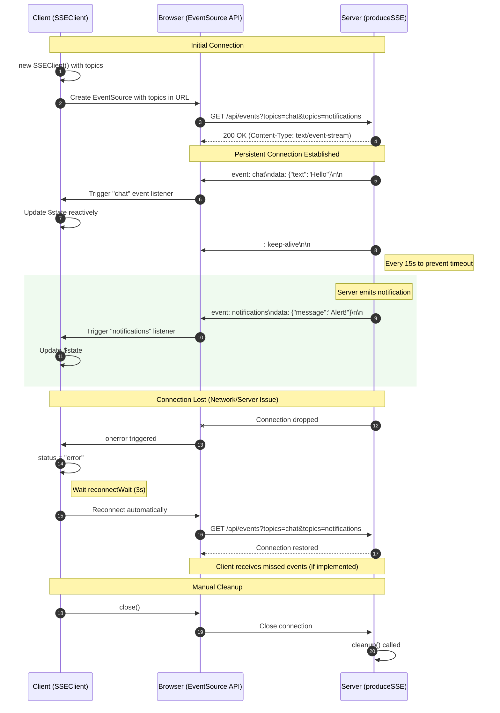

# SvelteKit SSE

Complete and type-safe **Server-Sent Events (SSE)** implementation for **Svelte 5** and **SvelteKit**, with automatic reconnection, reactive state, multiple topics support, and TypeScript.

## 📋 Table of Contents

- [🚀 Key Features](#-key-features)
- [🛠️ Tech Stack](#️-tech-stack)
- [🏗️ Architecture and Patterns](#️-architecture-and-patterns)
- [📖 What is Server-Sent Events (SSE)?](#-what-is-server-sent-events-sse)
  - [🎯 Perfect Use Cases](#-perfect-use-cases)
  - [⚔️ SSE vs WebSocket vs Long Polling](#️-sse-vs-websocket-vs-long-polling)
  - [✅ Advantages of SSE](#-advantages-of-sse)
  - [❌ When NOT to Use SSE](#-when-not-to-use-sse)
- [🔍 How It Works](#-how-it-works)
- [⚙️ Prerequisites](#️-prerequisites)
- [🚀 Installation and Setup](#-installation-and-setup)
- [🏃‍♂️ Running the Project](#️-running-the-project)
- [📝 Available Scripts](#-available-scripts)
- [📁 Project Structure](#-project-structure)
- [🔧 Client API (SSEClient)](#-client-api-sseclient)
- [🔧 Server API (produceSSE)](#-server-api-producesse)
- [📊 Demo: Interactive Chat + Notifications System](#-demo-interactive-chat--notifications-system)
- [🎯 Use Cases and Patterns](#-use-cases-and-patterns)
- [🔒 Security and Best Practices](#-security-and-best-practices)
- [🐛 Debugging and Troubleshooting](#-debugging-and-troubleshooting)
- [❓ Frequently Asked Questions (FAQ)](#-frequently-asked-questions-faq)
- [🚀 Deploy](#-deploy)
- [🤝 Contributing](#-contributing)
- [📚 Additional Resources](#-additional-resources)
- [🎓 Key Takeaways](#-key-takeaways)
- [📄 License](#-license)

## 🚀 Key Features

- ⚡ **Reactive SSE client** with Svelte 5 runes (`$state`, `$effect`)
- 🎯 **Multi-topic support** — Subscribe to multiple event types in a single connection
- 🔄 **Automatic reconnection** with configurable timeout and exponential backoff
- 🔒 **Type-safe** with TypeScript generics for each topic
- 📡 **Automatic keep-alive** to maintain stable connections (15s interval)
- 🎨 **State management** (idle, connecting, connected, error) with reactive properties
- 🔌 **Simple and intuitive API** for both client and server
- 🛡️ **Robust error handling** with visual feedback
- 🧹 **Automatic cleanup** of resources and subscriptions
- 📦 **Zero external dependencies** (only Svelte and SvelteKit)
- 🐛 **Debug mode** for development and troubleshooting

## 🛠️ Tech Stack

### 🎨 Frontend

- **[Svelte 5](https://svelte.dev/)** — reactive framework with runes
- **[SvelteKit 2](https://kit.svelte.dev/)** — full-stack framework for Svelte
- **[TypeScript](https://www.typescriptlang.org/)** — static typing
- **[Tailwind CSS 4](https://tailwindcss.com/)** — utility-first CSS framework
- **[Vite 7](https://vitejs.dev/)** — ultra-fast build tool and dev server

### 🔧 Development Tools

- **[Biome](https://biomejs.dev/)** — linting and formatting
- **[Ultracite](https://ultracite.dev/)** — unified CLI for linting
- **[pnpm](https://pnpm.io/)** — fast and efficient package manager

## 🏗️ Architecture and Patterns

This implementation follows modern web development patterns:

- **🎯 Type-safe:** TypeScript generics ensure compile-time safety for all event types
- **⚛️ Native reactivity:** Leverages Svelte 5 runes (`$state`, `$effect`, `$derived`) for automatic UI updates
- **🔌 SSE standard:** Complete implementation of the Server-Sent Events protocol (EventSource API)
- **🔄 Resilient:** Automatic reconnection with exponential backoff in case of failures
- **📊 State management:** Clear connection states (idle, connecting, connected, error)
- **🧩 Modular:** Clear separation between client hooks, server utilities, and context management
- **♻️ Lifecycle management:** Automatic resource cleanup prevents memory leaks
- **🎭 Topics-based:** Subscribe to multiple event types on a single connection
- **🔐 Secure by default:** Works with SvelteKit's built-in authentication and session management

### Browser Compatibility

| Browser | Support         |
| ------- | --------------- |
| Chrome  | ✅ All versions  |
| Firefox | ✅ All versions  |
| Safari  | ✅ All versions  |
| Edge    | ✅ All versions  |
| Opera   | ✅ All versions  |
| IE 11   | ❌ Not supported |

**Note for IE support:** Use the [event-source-polyfill](https://github.com/Yaffle/EventSource) package:

```bash
pnpm add event-source-polyfill
```

```typescript
// src/lib/hooks/sse.hook.svelte.ts
import { EventSourcePolyfill } from "event-source-polyfill";

// Replace native EventSource with polyfill
const EventSourceClass = typeof EventSource !== "undefined" 
  ? EventSource 
  : EventSourcePolyfill;

this.#eventSource = new EventSourceClass(url.toString());
```

## 📖 What is Server-Sent Events (SSE)?

**Server-Sent Events (SSE)** is a web technology that enables servers to push real-time updates to clients over a persistent HTTP connection. It's part of the HTML5 standard and provides a simple, efficient way to stream data from server to client.

### 🎯 Perfect Use Cases

- 📢 **Real-time notifications** — New messages, alerts, mentions
- 📊 **Live dashboards** — Stock prices, analytics, monitoring
- 📈 **Progress tracking** — Upload/download status, task completion
- 💬 **Activity feeds** — Social media updates, news feeds
- 🔔 **System alerts** — Server status, error notifications
- 🎮 **Live scores** — Sports, gaming leaderboards
- 💬 **Chat applications** — Message streaming (receive-only)
- 🤖 **AI streaming responses** — GPT-style text generation

### ⚔️ SSE vs WebSocket vs Long Polling

| Feature             | SSE                  | WebSocket             | Long Polling              |
| ------------------- | -------------------- | --------------------- | ------------------------- |
| **Direction**       | Server → Client only | Bidirectional         | Client → Server (request) |
| **Protocol**        | HTTP                 | WebSocket (ws://)     | HTTP                      |
| **Complexity**      | Simple               | Complex               | Very Simple               |
| **Auto-reconnect**  | ✅ Built-in           | ❌ Manual              | ❌ Manual                  |
| **Event Types**     | ✅ Named events       | ❌ Raw messages        | ❌ Raw messages            |
| **Browser Support** | ✅ All modern         | ✅ All modern          | ✅ Universal               |
| **Firewall/Proxy**  | ✅ Compatible         | ⚠️ May block           | ✅ Compatible              |
| **Overhead**        | Low                  | Very Low              | High (repeated requests)  |
| **Best for**        | Real-time updates    | Real-time chat, games | Simple polling            |

### ✅ Advantages of SSE

- **Standard HTTP** — No special protocol required
- **Automatic reconnection** — Built into the browser's EventSource API
- **Event IDs** — Resume from last received event after reconnection
- **Simple implementation** — Less boilerplate than WebSocket
- **Better compatibility** — Works through most proxies and CDNs
- **Named events** — Multiple event types on the same connection
- **Text-based** — Easy to debug with browser DevTools
- **Efficient** — One persistent connection, no polling overhead

### ❌ When NOT to Use SSE

- **Bidirectional communication** — Use WebSocket instead
- **Binary data** — WebSocket handles binary better
- **Very high frequency** — WebSocket has lower overhead
- **IE support required** — SSE not supported in IE (use polyfill or WebSocket)

## 🔍 How It Works

### Connection Flow Diagram



### SSE Message Format

SSE uses a simple text-based protocol. Messages are sent as UTF-8 text with specific field formats:

```text
event: notification
data: {"id": "123", "message": "Hello World"}

: This is a comment (keep-alive)

event: message
data: {"text": "Multi-line messages"}
data: {"can": "span multiple data fields"}
```

**Field types:**
- `event:` — Event name (e.g., "notification", "message")
- `data:` — Event data (usually JSON)
- `id:` — Event ID for resumption (this project doesn't use it yet)
- `retry:` — Reconnection time in milliseconds
- `:` — Comment (used for keep-alive)

Each message ends with **two newlines** (`\n\n`).

## ⚙️ Prerequisites

Before you begin, make sure you have installed:

- **[Node.js](https://nodejs.org/)** >= 18.0.0
- **[pnpm](https://pnpm.io/)** >= 9.0.0 (package manager)

## 🚀 Installation and Setup

### 1️⃣ Clone the repository

```bash
git clone https://github.com/gustavomorinaga/sveltekit-sse.git
cd sveltekit-sse
```

### 2️⃣ Install dependencies

```bash
pnpm install
```

### 3️⃣ Start the development server

```bash
pnpm dev
```

The project will be available at:
- **Application:** <http://localhost:5173>

## 🏃‍♂️ Running the Project

### Development

```bash
pnpm dev
```

### Production Build

```bash
pnpm build
```

### Build Preview

```bash
pnpm preview
```

## 📝 Available Scripts

- `pnpm dev` — starts development server
- `pnpm build` — creates production build
- `pnpm preview` — previews production build
- `pnpm check` — checks TypeScript and Svelte types
- `pnpm check:watch` — checks types in watch mode
- `pnpm format` — formats code with Ultracite
- `pnpm lint` — runs linting with Ultracite

## 📁 Project Structure

```text
sveltekit-sse/
├─ src/
│  ├─ lib/
│  │  ├─ components/                           # Svelte components
│  │  │  ├─ chat/
│  │  │  │  ├─ chat.component.svelte           # Interactive chat UI
│  │  │  │  └─ index.ts                        # Component exports
│  │  │  ├─ notifications/
│  │  │  │  ├─ notifications.component.svelte  # Notifications display
│  │  │  │  └─ index.ts
│  │  │  └─ toolbar/
│  │  │      ├─ toolbar.component.svelte       # Connection status toolbar
│  │  │      └─ index.ts
│  │  ├─ contexts/                             # Svelte 5 contexts
│  │  │  └─ events.context.svelte.ts           # Global SSE state management
│  │  ├─ hooks/                                # Custom Svelte hooks
│  │  │  └─ sse.hook.svelte.ts                 # Reactive SSE client class
│  │  ├─ mock/                                 # Mock data for demo
│  │  │  ├─ chat.mock.ts                       # Story script data
│  │  │  └─ notifications.mock.ts              # Sample notifications
│  │  ├─ server/                               # Server-side utilities
│  │  │  ├─ sse.ts                             # SSE response producer
│  │  │  └─ story-engine.ts                    # Chat story state machine
│  │  └─ ts/                                   # TypeScript definitions
│  │      ├─ chat.ts                           # Chat message types
│  │      ├─ notification.ts                   # Notification types
│  │      ├─ sse-topics.ts                     # SSE topics map (type-safe)
│  │      └─ index.ts                          # Type exports
│  ├─ routes/                                  # SvelteKit routes
│  │  ├─ +layout.svelte                        # Root layout
│  │  ├─ +page.svelte                          # Home page (demo)
│  │  ├─ layout.css                            # Global styles
│  │  └─ api/                                  # API endpoints
│  │      ├─ chat/
│  │      │  └─ +server.ts                     # HTTP POST for chat actions
│  │      └─ events/
│  │          └─ +server.ts                    # SSE endpoint (main)
│  ├─ app.d.ts                                 # TypeScript app definitions
│  └─ app.html                                 # HTML template
├─ static/                                     # Static assets
│  ├─ assets/                                  # Images, fonts, etc.
│  └─ robots.txt
├─ .nvmrc                                      # Node version specification
├─ biome.jsonc                                 # Biome (linter/formatter) config
├─ package.json                                # Dependencies and scripts
├─ pnpm-lock.yaml                              # pnpm lock file
├─ pnpm-workspace.yaml                         # pnpm workspace configuration
├─ svelte.config.js                            # SvelteKit configuration
├─ tsconfig.json                               # TypeScript configuration
├─ vite.config.ts                              # Vite configuration
└─ README.md                                   # This documentation
```

### Key Files Explained

| File                                        | Purpose                                                                |
| ------------------------------------------- | ---------------------------------------------------------------------- |
| `src/lib/hooks/sse.hook.svelte.ts`          | **Core SSE client** — Reactive EventSource wrapper with auto-reconnect |
| `src/lib/server/sse.ts`                     | **Server producer** — Creates SSE Response with keep-alive             |
| `src/lib/contexts/events.context.svelte.ts` | **Global state** — Manages SSE connection and data across components   |
| `src/lib/ts/sse-topics.ts`                  | **Type safety** — Defines all SSE topics and their data shapes         |
| `src/routes/api/events/+server.ts`          | **Main SSE endpoint** — Streams multiple topics (chat, notifications)  |
| `src/routes/api/chat/+server.ts`            | **Chat actions** — HTTP POST endpoint for user interactions            |
| `src/lib/server/story-engine.ts`            | **Story logic** — State machine for interactive chat demo              |
| `src/lib/components/*/`                     | **UI components** — Reusable Svelte 5 components with runes            |

## 🔧 Client API (SSEClient)

### Type-Safe Topics System

This implementation uses a **topics-based approach** where you define a map of event types and their corresponding data shapes:

```typescript
// Define your topics and their data types
interface SSETopicsMap {
  chat: { id: string; text: string; sender: string };
  notification: { id: string; message: string; type: "info" | "error" };
  progress: { percent: number; taskId: string };
}
```

### Creating an SSEClient Instance

```typescript
import { SSEClient } from "$lib/hooks/sse.hook.svelte";

const client = new SSEClient<SSETopicsMap>("/api/events", {
  topics: {
    // Subscribe to specific topics with callbacks
    chat: (data) => {
      console.log("New chat message:", data.text);
    },
    notification: (data) => {
      console.log(`${data.type}: ${data.message}`);
    },
    // You can subscribe to some topics and ignore others
  },
  reconnectWait: 3000,     // Wait time for reconnection (default: 3000ms)
  autoConnect: true,       // Connect automatically (default: true)
  debug: false,            // Enable console logs (default: false)
});
```

### Constructor Options

```typescript
interface SSEOptions<TTopics> {
  // Map of topic names to their callback functions
  topics: {
    [K in keyof TTopics]?: (data: TTopics[K]) => void;
  };
  
  // Time to wait before reconnecting after error (milliseconds)
  reconnectWait?: number; // default: 3000
  
  // Automatically connect on instantiation
  autoConnect?: boolean; // default: true
  
  // Enable debug logging in console
  debug?: boolean; // default: false
}
```

### Reactive Properties

The client exposes reactive properties using Svelte 5 runes:

```typescript
// Connection status (reactive)
client.status // "idle" | "connecting" | "connected" | "error"

// Error object if status is "error" (reactive)
client.error // Error | null
```

### Methods

```typescript
// Manually connect (if autoConnect: false)
client.connect();

// Disconnect and cleanup
client.close();
```

### Complete Component Example

```svelte
<script lang="ts">
  import { SSEClient } from "$lib/hooks/sse.hook.svelte";

  interface Message {
    id: string;
    text: string;
    timestamp: number;
  }
  
  interface Notification {
    id: string;
    message: string;
    type: "info" | "error";
  }
  
  interface TopicsMap {
    message: Message;
    notification: Notification;
  }

  let messages = $state<Message[]>([]);
  let notifications = $state<Notification[]>([]);

  // Subscribe to multiple topics in one connection
  const stream = new SSEClient<TopicsMap>("/api/stream", {
    topics: {
      message: (msg) => {
        messages = [...messages, msg];
      },
      notification: (notif) => {
        notifications = [notif, ...notifications].slice(0, 5); // Keep last 5
      },
    },
    debug: true, // See logs in console
  });
</script>

<div class="dashboard">
  <!-- Connection Status Indicator -->
  <div class="status" data-status={stream.status}>
    {#if stream.status === "connected"}
      🟢 Connected
    {:else if stream.status === "connecting"}
      🟡 Connecting...
    {:else if stream.status === "error"}
      🔴 Error: {stream.error?.message}
      <button onclick={stream.connect}>Retry</button>
    {:else}
      ⚪ Disconnected
      <button onclick={stream.connect}>Connect</button>
    {/if}
  </div>

  <!-- Messages List -->
  <section>
    <h2>Messages</h2>
    {#each messages as message (message.id)}
      <div class="message">
        {message.text}
        <small>{new Date(message.timestamp).toLocaleTimeString()}</small>
      </div>
    {/each}
  </section>

  <!-- Notifications List -->
  <section>
    <h2>Notifications</h2>
    {#each notifications as notification (notification.id)}
      <div class="notification" data-type={notification.type}>
        {notification.message}
      </div>
    {/each}
  </section>
</div>

<style>
  .status[data-status="connected"] { color: green; }
  .status[data-status="error"] { color: red; }
  .notification[data-type="error"] { background: #fee; }
</style>
```

### Using with Svelte Context API

For global state management across components:

```typescript
// events.context.svelte.ts
import { getContext, setContext } from "svelte";
import { SSEClient } from "$lib/hooks/sse.hook.svelte";

interface TopicsMap {
  message: { text: string };
  notification: { message: string };
}

class EventsContext {
  messages = $state<string[]>([]);
  
  readonly stream = new SSEClient<TopicsMap>("/api/events", {
    topics: {
      message: (data) => this.messages.push(data.text),
      notification: (data) => alert(data.message),
    },
  });
}

const KEY = Symbol("events");

export function setEventsContext() {
  return setContext(KEY, new EventsContext());
}

export function getEventsContext() {
  return getContext<EventsContext>(KEY);
}
```

```svelte
<!-- +layout.svelte -->
<script lang="ts">
  import { setEventsContext } from "$lib/contexts/events.context.svelte";
  setEventsContext();
</script>

<slot />
```

```svelte
<!-- +page.svelte -->
<script lang="ts">
  import { getEventsContext } from "$lib/contexts/events.context.svelte";
  
  const { messages, stream } = getEventsContext();
</script>

<div>
  Status: {stream.status}
  {#each messages as message}
    <p>{message}</p>
  {/each}
</div>
```

## 🔧 Server API (produceSSE)

### Creating an SSE Endpoint

```typescript
// src/routes/api/events/+server.ts
import { produceSSE } from "$lib/server/sse";

interface TopicsMap {
  message: { id: string; text: string };
  notification: { id: string; message: string; type: string };
}

export const GET = () => {
  return produceSSE<TopicsMap>((emit) => {
    // Send events periodically
    const interval = setInterval(() => {
      emit("message", {
        id: crypto.randomUUID(),
        text: "New message!",
      });
    }, 1000);

    // Cleanup function (called when connection closes)
    return () => {
      clearInterval(interval);
      console.log("Client disconnected");
    };
  });
};
```

### produceSSE Function Signature

```typescript
type SSEEmitter<TTopics> = <K extends keyof TTopics>(
  eventName: K,
  data: TTopics[K]
) => void;

type SSEProducer<TTopics> = (
  emit: SSEEmitter<TTopics>
) => () => void;

function produceSSE<TTopics>(
  producer: SSEProducer<TTopics>
): Response
```

**Parameters:**
- `producer`: Function that receives an `emit` callback and returns a cleanup function
  - `emit(eventName, data)`: Sends a typed event to the client
  - `return`: Cleanup function executed when the connection is closed

**Returns:**
- `Response`: HTTP response with configured SSE stream and headers:
  - `Content-Type: text/event-stream`
  - `Cache-Control: no-cache, no-transform`
  - `Connection: keep-alive`

**Automatic Features:**
- ✅ Keep-alive ping every 15 seconds (`: keep-alive\n\n`)
- ✅ Proper cleanup on client disconnect
- ✅ Error handling and logging

### Accessing Request Data

Use SvelteKit's `RequestEvent` parameter to access cookies, headers, URL params, etc.:

```typescript
import type { RequestEvent } from "@sveltejs/kit";

export const GET = ({ cookies, url, request, locals }: RequestEvent) => {
  // Get requested topics from URL query params
  const topics = url.searchParams.getAll("topics");
  
  // Access authentication
  const userId = locals.user?.id;
  
  // Get session
  const sessionId = cookies.get("session_id");

  return produceSSE<TopicsMap>((emit) => {
    // Only send events for requested topics
    if (topics.includes("notifications")) {
      const interval = setInterval(() => {
        emit("notifications", {
          userId,
          message: "New notification",
        });
      }, 5000);
      
      return () => clearInterval(interval);
    }

    return () => {}; // Empty cleanup if no topics
  });
};
```

### Example: Multiple Topics with Different Sources

```typescript
interface TopicsMap {
  chat: { id: string; text: string; sender: string };
  notifications: { id: string; message: string };
  metrics: { cpu: number; memory: number };
}

export const GET = ({ url }) => {
  const requestedTopics = url.searchParams.getAll("topics");

  return produceSSE<TopicsMap>((emit) => {
    const cleanupFunctions: Array<() => void> = [];

    // Chat messages (if requested)
    if (requestedTopics.includes("chat")) {
      const unsubscribeChat = subscribeToChat((message) => {
        emit("chat", message);
      });
      cleanupFunctions.push(unsubscribeChat);
    }

    // Notifications (if requested)
    if (requestedTopics.includes("notifications")) {
      const unsubscribeNotif = subscribeToNotifications((notif) => {
        emit("notifications", notif);
      });
      cleanupFunctions.push(unsubscribeNotif);
    }

    // System metrics (if requested)
    if (requestedTopics.includes("metrics")) {
      const metricsInterval = setInterval(async () => {
        const metrics = await getSystemMetrics();
        emit("metrics", metrics);
      }, 5000);
      cleanupFunctions.push(() => clearInterval(metricsInterval));
    }

    // Cleanup all subscriptions
    return () => {
      cleanupFunctions.forEach(fn => fn());
    };
  });
};
```

### Example: Database Changes

```typescript
import { db } from "$lib/server/db";

interface TopicsMap {
  order: {
    id: string;
    status: "pending" | "completed";
    total: number;
  };
}

export const GET = ({ locals }) => {
  if (!locals.user) {
    return new Response("Unauthorized", { status: 401 });
  }

  return produceSSE<TopicsMap>((emit) => {
    // Subscribe to database changes
    const unsubscribe = db.orders
      .where("userId", "==", locals.user.id)
      .onSnapshot((snapshot) => {
        snapshot.docChanges().forEach((change) => {
          if (change.type === "modified" || change.type === "added") {
            const order = change.doc.data();
            emit("order", {
              id: order.id,
              status: order.status,
              total: order.total,
            });
          }
        });
      });

    return () => {
      unsubscribe();
      console.log(`User ${locals.user.id} disconnected`);
    };
  });
};
```

### Example: External API Webhook

```typescript
interface TopicsMap {
  payment: {
    orderId: string;
    status: "success" | "failed";
    amount: number;
  };
}

// Global event emitter for webhooks
const paymentEmitter = new EventEmitter();

// Webhook endpoint
export const POST = async ({ request }) => {
  const webhook = await request.json();
  
  // Emit to all connected SSE clients
  paymentEmitter.emit("payment", {
    orderId: webhook.orderId,
    status: webhook.status,
    amount: webhook.amount,
  });
  
  return json({ received: true });
};

// SSE endpoint
export const GET = () => {
  return produceSSE<TopicsMap>((emit) => {
    const handler = (data: TopicsMap["payment"]) => {
      emit("payment", data);
    };
    
    paymentEmitter.on("payment", handler);
    
    return () => {
      paymentEmitter.off("payment", handler);
    };
  });
};
```

## 📊 Demo: Interactive Chat + Notifications System

This project includes a complete demo showcasing SSE capabilities with **two real-time features** running simultaneously:

### 🎮 1. Interactive Story-based Chat

An interactive text adventure that demonstrates:
- **Bidirectional communication** (SSE for receiving, HTTP POST for sending)
- **Session management** with cookies
- **State restoration** on reconnection (chat history)
- **Conditional prompts** (wait for user input)
- **Timed events** (story progresses automatically)

#### Server Implementation

```typescript
// src/routes/api/events/+server.ts
export const GET = ({ cookies, url }) => {
  const requestedTopics = url.searchParams.getAll("topics");
  
  let sessionID = cookies.get("story_session");
  if (!sessionID) {
    sessionID = crypto.randomUUID();
    cookies.set("story_session", sessionID, { path: "/", httpOnly: true });
  }

  return produceSSE<SSETopicsMap>((emit) => {
    const session = getSession(sessionID);
    session.emitter = emit;

    if (requestedTopics.includes("message")) {
      // Restore chat history on reconnect
      if (session.history.length > 0) {
        emit("history", session.history);
      }
      
      // Continue story or wait for user input
      playStory(sessionID);
    }

    return () => {
      // Cleanup on disconnect
      session.emitter = null;
    };
  });
};
```

#### Story Engine (Server-side State Machine)

```typescript
// src/lib/server/story-engine.ts
interface PlayerSession {
  step: number;
  timeoutID?: ReturnType<typeof setTimeout>;
  emitter: SSEEmitter<SSETopicsMap> | null;
  history: ChatMessage[];
}

export function playStory(sessionId: string) {
  const session = getSession(sessionId);
  if (!session?.emitter) return;

  const node = SCRIPT[session.step];

  if (node.type === "npc") {
    // NPC message - send and auto-advance after delay
    const message: ChatMessage = {
      id: crypto.randomUUID(),
      sender: node.name,
      text: node.text,
    };
    session.history.push(message);
    session.emitter("message", message);
    session.step++;
    session.timeoutID = setTimeout(() => playStory(sessionId), node.delay);
    
  } else if (node.type === "prompt") {
    // User input required - send prompt and wait
    session.emitter("prompt", {
      id: crypto.randomUUID(),
      sender: "System",
      text: node.text,
    });
  }
}
```

#### Client-side Chat Component

```svelte
<!-- src/lib/components/chat/chat.component.svelte -->
<script lang="ts">
  import { getEventsContext } from "$lib/contexts/events.context.svelte";

  const { chat, expectedPrompt, sendPrompt, resetChat } = getEventsContext();
  
  const isWaitingForUser = $derived(expectedPrompt !== null);
</script>

<section class="chat">
  <header>
    <h3>💬 Chat</h3>
    <button onclick={resetChat}>Reset</button>
  </header>

  <!-- Messages displayed in reverse chronological order -->
  <ul class="messages">
    {#each chat as message (message.id)}
      <li class:mine={message.isMe}>
        <strong>{message.sender}</strong>
        <p>{message.text}</p>
      </li>
    {/each}
  </ul>

  <!-- User input -->
  <footer>
    <form onsubmit={sendPrompt}>
      <input 
        value={expectedPrompt || "Waiting for story..."}
        readonly 
        disabled={!isWaitingForUser}
      />
      <button type="submit" disabled={!isWaitingForUser}>
        Send
      </button>
    </form>
  </footer>
</section>
```

### 🔔 2. Real-Time Notifications

Demonstrates periodic server-sent notifications:

#### Server

```typescript
// Part of the same /api/events endpoint
const notificationsInterval = setInterval(() => {
  if (requestedTopics.includes("notifications")) {
    const randomNotification = getRandomNotification();
    
    emit("notifications", {
      id: crypto.randomUUID(),
      ...randomNotification,
      timestamp: new Date().toLocaleTimeString(),
    });
  }
}, 3000); // Every 3 seconds

return () => {
  clearInterval(notificationsInterval);
};
```

#### Client

```svelte
<!-- src/lib/components/notifications/notifications.component.svelte -->
<script lang="ts">
  import { getEventsContext } from "$lib/contexts/events.context.svelte";

  const { notifications } = getEventsContext();
</script>

<section class="notifications">
  <header>
    <h3>🔔 Notifications</h3>
    <span class="count">{notifications.length}</span>
  </header>

  <ul>
    {#each notifications as notif (notif.id)}
      <li class:error={notif.type === "error"}>
        <strong>{notif.timestamp}</strong>
        {notif.message}
      </li>
    {/each}
  </ul>
</section>
```

### 🎯 Key Learnings from the Demo

1. **Multiple Topics in One Connection**
   - Both chat and notifications use the same SSE connection
   - Topics are filtered server-side based on URL parameters
   - Reduces overhead compared to multiple connections

2. **Session Persistence**
   - Chat history survives page reloads
   - Server maintains state per session
   - Reconnection restores full context

3. **Hybrid Communication**
   - SSE for server → client (messages, notifications)
   - HTTP POST for client → server (user responses)
   - Best of both worlds for interactive apps

4. **Proper Resource Management**
   - Cleanup functions clear intervals
   - Session state is properly managed
   - No memory leaks on disconnect

## 🎯 Use Cases and Patterns

### 1. Real-Time Dashboard with Live Metrics

**Scenario:** Monitor system health with live CPU, memory, and network metrics.

```typescript
// Server: src/routes/api/dashboard/+server.ts
interface DashboardTopics {
  metrics: {
    cpu: number;
    memory: number;
    network: { in: number; out: number };
  };
  alerts: {
    level: "info" | "warning" | "critical";
    message: string;
  };
}

export const GET = () => {
  return produceSSE<DashboardTopics>((emit) => {
    // Send metrics every 2 seconds
    const metricsInterval = setInterval(async () => {
      const metrics = await getSystemMetrics();
      emit("metrics", metrics);
      
      // Send alert if CPU is high
      if (metrics.cpu > 80) {
        emit("alerts", {
          level: "warning",
          message: `High CPU usage: ${metrics.cpu}%`,
        });
      }
    }, 2000);

    return () => clearInterval(metricsInterval);
  });
};
```

```svelte
<!-- Client -->
<script lang="ts">
  let cpuHistory = $state<number[]>([]);
  
  const stream = new SSEClient<DashboardTopics>("/api/dashboard", {
    topics: {
      metrics: (data) => {
        cpuHistory = [...cpuHistory, data.cpu].slice(-20); // Keep last 20
      },
      alerts: (data) => {
        toast.show(data.message, data.level);
      },
    },
  });
</script>

<Dashboard {cpuHistory} status={stream.status} />
```

### 2. Multi-User Activity Feed

**Scenario:** Social feed with likes, comments, and follows in real-time.

```typescript
// Server
interface FeedTopics {
  like: { postId: string; userId: string; userName: string };
  comment: { postId: string; text: string; userId: string };
  follow: { followerId: string; followingId: string };
}

export const GET = ({ locals }) => {
  if (!locals.user) {
    return new Response("Unauthorized", { status: 401 });
  }

  return produceSSE<FeedTopics>((emit) => {
    const userId = locals.user.id;
    
    // Subscribe to relevant activities
    const unsubscribeLikes = subscribeToLikes(userId, (like) => {
      emit("like", like);
    });
    
    const unsubscribeComments = subscribeToComments(userId, (comment) => {
      emit("comment", comment);
    });
    
    const unsubscribeFollows = subscribeToFollows(userId, (follow) => {
      emit("follow", follow);
    });

    return () => {
      unsubscribeLikes();
      unsubscribeComments();
      unsubscribeFollows();
    };
  });
};
```

```svelte
<!-- Client -->
<script lang="ts">
  let activities = $state<Activity[]>([]);
  
  const feed = new SSEClient<FeedTopics>("/api/feed", {
    topics: {
      like: (data) => {
        activities.unshift({
          type: "like",
          text: `${data.userName} liked your post`,
          timestamp: Date.now(),
        });
      },
      comment: (data) => {
        activities.unshift({
          type: "comment",
          text: `New comment: "${data.text}"`,
          timestamp: Date.now(),
        });
        // Update post comments count
        updatePostComments(data.postId);
      },
      follow: (data) => {
        activities.unshift({
          type: "follow",
          text: "Someone started following you",
          timestamp: Date.now(),
        });
      },
    },
  });
</script>
```

### 3. Long-Running Task Progress

**Scenario:** Track progress of file uploads, data processing, or batch operations.

```typescript
// Server
interface TaskTopics {
  progress: { taskId: string; percent: number; step: string };
  complete: { taskId: string; result: unknown };
  error: { taskId: string; error: string };
}

export const GET = ({ url, locals }) => {
  const taskId = url.searchParams.get("taskId");
  if (!taskId) {
    return new Response("Missing taskId", { status: 400 });
  }

  return produceSSE<TaskTopics>((emit) => {
    const task = getTask(taskId);
    
    // Task progress updates
    task.on("progress", (data) => {
      emit("progress", {
        taskId,
        percent: data.percent,
        step: data.step,
      });
    });
    
    // Task completion
    task.on("complete", (result) => {
      emit("complete", { taskId, result });
    });
    
    // Task errors
    task.on("error", (error) => {
      emit("error", { taskId, error: error.message });
    });

    return () => task.cleanup();
  });
};
```

```svelte
<!-- Client -->
<script lang="ts">
  let progress = $state(0);
  let currentStep = $state("Initializing...");
  let result = $state<unknown>(null);
  
  const taskStream = new SSEClient<TaskTopics>(
    `/api/task?taskId=${taskId}`,
    {
      topics: {
        progress: (data) => {
          progress = data.percent;
          currentStep = data.step;
        },
        complete: (data) => {
          result = data.result;
          taskStream.close();
        },
        error: (data) => {
          alert(`Error: ${data.error}`);
          taskStream.close();
        },
      },
    }
  );
</script>

<div>
  <progress value={progress} max="100" />
  <p>{currentStep} - {progress}%</p>
  {#if result}
    <div>✅ Task completed! Result: {JSON.stringify(result)}</div>
  {/if}
</div>
```

### 4. Collaborative Editing (Presence & Cursors)

**Scenario:** Show who's online and where they're editing in real-time.

```typescript
// Server
interface CollabTopics {
  presence: { userId: string; userName: string; status: "online" | "offline" };
  cursor: { userId: string; position: { line: number; column: number } };
  edit: { userId: string; changes: TextChange[] };
}

export const GET = ({ url, locals }) => {
  const documentId = url.searchParams.get("docId");
  
  return produceSSE<CollabTopics>((emit) => {
    const userId = locals.user.id;
    
    // Broadcast user presence
    broadcastPresence(documentId, {
      userId,
      userName: locals.user.name,
      status: "online",
    });
    
    // Subscribe to other users' activities
    const unsubPresence = subscribeToPresence(documentId, (data) => {
      if (data.userId !== userId) emit("presence", data);
    });
    
    const unsubCursors = subscribeToCursors(documentId, (data) => {
      if (data.userId !== userId) emit("cursor", data);
    });
    
    const unsubEdits = subscribeToEdits(documentId, (data) => {
      if (data.userId !== userId) emit("edit", data);
    });

    return () => {
      // Broadcast offline status
      broadcastPresence(documentId, {
        userId,
        userName: locals.user.name,
        status: "offline",
      });
      
      unsubPresence();
      unsubCursors();
      unsubEdits();
    };
  });
};
```

### 5. AI Streaming Responses (ChatGPT-style)

**Scenario:** Stream AI-generated text token by token.

```typescript
// Server
interface AITopics {
  token: { text: string; index: number };
  complete: { fullText: string; tokensUsed: number };
}

export const POST = async ({ request }) => {
  const { prompt } = await request.json();
  
  return produceSSE<AITopics>((emit) => {
    let index = 0;
    let fullText = "";
    
    // Stream tokens from AI model
    const stream = openai.chat.completions.create({
      model: "gpt-4",
      messages: [{ role: "user", content: prompt }],
      stream: true,
    });
    
    (async () => {
      for await (const chunk of stream) {
        const token = chunk.choices[0]?.delta?.content || "";
        if (token) {
          fullText += token;
          emit("token", { text: token, index: index++ });
        }
      }
      
      emit("complete", {
        fullText,
        tokensUsed: index,
      });
    })();

    return () => {
      // Cancel stream if client disconnects
      stream.controller?.abort();
    };
  });
};
```

```svelte
<!-- Client -->
<script lang="ts">
  let response = $state("");
  let isComplete = $state(false);
  
  function askAI(prompt: string) {
    response = "";
    isComplete = false;
    
    const stream = new SSEClient<AITopics>("/api/ai", {
      topics: {
        token: (data) => {
          response += data.text;
        },
        complete: (data) => {
          isComplete = true;
          console.log(`Used ${data.tokensUsed} tokens`);
          stream.close();
        },
      },
    });
  }
</script>

<div>
  <input onsubmit={() => askAI(promptValue)} />
  <div class="response">
    {response}
    {#if !isComplete}<span class="cursor">▋</span>{/if}
  </div>
</div>
```

## 🔒 Security and Best Practices

### 1. Authentication and Authorization

**Always verify user identity** before sending sensitive data:

```typescript
import type { RequestEvent } from "@sveltejs/kit";

export const GET = async ({ locals, cookies }: RequestEvent) => {
  // Check if user is authenticated
  if (!locals.user) {
    return new Response("Unauthorized", { status: 401 });
  }

  return produceSSE<TopicsMap>((emit) => {
    const userId = locals.user.id;
    
    // Only send events relevant to this user
    const unsubscribe = subscribeToUserEvents(userId, (event) => {
      emit("notification", event);
    });

    return unsubscribe;
  });
};
```

### 2. Rate Limiting

**Prevent abuse** by limiting connections per IP or user:

```typescript
// src/lib/server/rate-limit.ts
const connections = new Map<string, number>();

export function checkRateLimit(identifier: string, max = 5): boolean {
  const count = connections.get(identifier) || 0;
  
  if (count >= max) {
    return false; // Exceeded limit
  }
  
  connections.set(identifier, count + 1);
  
  // Cleanup after 1 minute
  setTimeout(() => {
    connections.set(identifier, (connections.get(identifier) || 1) - 1);
  }, 60_000);
  
  return true;
}
```

```typescript
// src/routes/api/events/+server.ts
export const GET = ({ getClientAddress, locals }) => {
  const identifier = locals.user?.id || getClientAddress();
  
  if (!checkRateLimit(identifier)) {
    return new Response("Too Many Requests", { 
      status: 429,
      headers: { "Retry-After": "60" },
    });
  }

  return produceSSE<TopicsMap>((emit) => {
    // ...
  });
};
```

### 3. Connection Timeout

**Prevent infinite connections** that consume server resources:

```typescript
const MAX_CONNECTION_TIME = 15 * 60 * 1000; // 15 minutes

export const GET = () => {
  return produceSSE<TopicsMap>((emit) => {
    // Auto-close after timeout
    const timeout = setTimeout(() => {
      emit("timeout", { 
        message: "Connection expired. Please reconnect.",
      });
      // Connection will be closed automatically
    }, MAX_CONNECTION_TIME);

    return () => {
      clearTimeout(timeout);
    };
  });
};
```

### 4. Input Validation

**Validate topic subscriptions** to prevent abuse:

```typescript
const ALLOWED_TOPICS = ["chat", "notifications", "metrics"] as const;

export const GET = ({ url }) => {
  const requestedTopics = url.searchParams.getAll("topics");
  
  // Validate topics
  const invalidTopics = requestedTopics.filter(
    (topic) => !ALLOWED_TOPICS.includes(topic as any)
  );
  
  if (invalidTopics.length > 0) {
    return new Response(`Invalid topics: ${invalidTopics.join(", ")}`, {
      status: 400,
    });
  }
  
  // Limit number of topics
  if (requestedTopics.length > 10) {
    return new Response("Too many topics requested", { status: 400 });
  }

  return produceSSE<TopicsMap>((emit) => {
    // ...
  });
};
```

### 5. Data Sanitization

**Never send sensitive data** without filtering:

```typescript
export const GET = ({ locals }) => {
  return produceSSE<TopicsMap>((emit) => {
    const userId = locals.user.id;
    
    const unsubscribe = db.users.onChange((user) => {
      // ❌ BAD: Sending everything
      // emit("user", user);
      
      // ✅ GOOD: Only send what's needed
      emit("user", {
        id: user.id,
        name: user.name,
        avatar: user.avatar,
        // Don't send: password, email, tokens, etc.
      });
    });

    return unsubscribe;
  });
};
```

### 6. Error Handling

**Don't expose internal errors** to clients:

```typescript
export const GET = () => {
  return produceSSE<TopicsMap>((emit) => {
    try {
      const interval = setInterval(async () => {
        try {
          const data = await fetchExternalAPI();
          emit("data", data);
        } catch (error) {
          // Log internally
          console.error("[SSE] Error fetching data:", error);
          
          // Send generic error to client
          emit("error", {
            message: "Failed to fetch data. Please try again.",
            // Don't send: error.stack, internal details
          });
        }
      }, 5000);

      return () => clearInterval(interval);
    } catch (error) {
      console.error("[SSE] Fatal error:", error);
      throw error; // Will send 500 to client
    }
  });
};
```

### 7. CORS Configuration

**Configure CORS** properly for cross-origin requests:

```typescript
// svelte.config.js
export default {
  kit: {
    cors: {
      origin: process.env.NODE_ENV === "production"
        ? ["https://your-domain.com"]
        : "*",
      credentials: true,
    },
  },
};
```

```typescript
// For specific endpoints
export const GET = () => {
  const response = produceSSE<TopicsMap>((emit) => {
    // ...
  });
  
  // Add CORS headers if needed
  response.headers.set("Access-Control-Allow-Origin", "https://your-domain.com");
  response.headers.set("Access-Control-Allow-Credentials", "true");
  
  return response;
};
```

### 8. Resource Cleanup Checklist

**Always cleanup resources** to prevent memory leaks:

```typescript
export const GET = () => {
  return produceSSE<TopicsMap>((emit) => {
    // ✅ Track all resources
    const intervals: ReturnType<typeof setInterval>[] = [];
    const timeouts: ReturnType<typeof setTimeout>[] = [];
    const subscriptions: Array<() => void> = [];
    
    // Create interval
    const interval = setInterval(() => {
      emit("ping", { timestamp: Date.now() });
    }, 5000);
    intervals.push(interval);
    
    // Subscribe to events
    const unsubscribe = eventEmitter.on("data", (data) => {
      emit("data", data);
    });
    subscriptions.push(unsubscribe);
    
    // ✅ Cleanup ALL resources
    return () => {
      intervals.forEach((id) => clearInterval(id));
      timeouts.forEach((id) => clearTimeout(id));
      subscriptions.forEach((unsub) => unsub());
      
      console.log("[SSE] All resources cleaned up");
    };
  });
};
```

### 9. Performance Tips

**Optimize for scalability:**

```typescript
// ❌ BAD: Sending too much data too frequently
const interval = setInterval(() => {
  emit("data", hugeObject); // Large payload
}, 100); // Every 100ms

// ✅ GOOD: Throttle and compress
const interval = setInterval(() => {
  const summary = compressData(data); // Send only what's needed
  emit("data", summary);
}, 5000); // Reasonable interval
```

**Batch multiple updates:**

```typescript
// ❌ BAD: Emit on every change
db.collection.onChange((doc) => {
  emit("update", doc); // Can fire 100s of times per second
});

// ✅ GOOD: Batch updates
let batch: Doc[] = [];
let batchTimeout: ReturnType<typeof setTimeout>;

db.collection.onChange((doc) => {
  batch.push(doc);
  
  clearTimeout(batchTimeout);
  batchTimeout = setTimeout(() => {
    emit("updates", batch); // Send batch
    batch = [];
  }, 1000); // Wait 1s for more changes
});
```

### 10. Monitoring and Logging

**Track SSE connections** for debugging and analytics:

```typescript
// src/lib/server/sse-monitor.ts
export const activeConnections = new Map<string, {
  userId: string;
  connectedAt: Date;
  topics: string[];
}>();

export function trackConnection(id: string, metadata: any) {
  activeConnections.set(id, {
    ...metadata,
    connectedAt: new Date(),
  });
  
  console.log(`[SSE] Active connections: ${activeConnections.size}`);
}

export function untrackConnection(id: string) {
  activeConnections.delete(id);
  console.log(`[SSE] Active connections: ${activeConnections.size}`);
}
```

```typescript
// Use in endpoint
export const GET = ({ locals }) => {
  const connectionId = crypto.randomUUID();
  
  trackConnection(connectionId, {
    userId: locals.user?.id,
    topics: requestedTopics,
  });

  return produceSSE<TopicsMap>((emit) => {
    // ...
    
    return () => {
      untrackConnection(connectionId);
    };
  });
};
```

## 🐛 Debugging and Troubleshooting

### Enable Debug Mode

```typescript
// Client-side debugging
const client = new SSEClient<TopicsMap>("/api/events", {
  topics: { /* ... */ },
  debug: true, // Enable console logs
});

// Now you'll see:
// [SSE] SSEClient initialized { baseURL: "/api/events", options: {...} }
// [SSE] Connecting to SSE { url: "...", topics: ["chat", "notifications"] }
// [SSE] SSE connection opened
// [SSE] Event received on topic "chat" { id: "...", text: "..." }
```

### Browser DevTools

**1. Network Tab**
- Look for the SSE request (usually shows as "pending")
- Check Headers: `Content-Type: text/event-stream`
- View EventStream tab to see real-time events

**2. Console**
- With `debug: true`, see all client-side logs
- Look for connection errors

### Server-Side Logging

```typescript
export const GET = ({ locals }) => {
  const userId = locals.user?.id || "anonymous";
  console.log(`[SSE] New connection from user: ${userId}`);

  return produceSSE<TopicsMap>((emit) => {
    console.log(`[SSE] Starting event stream for ${userId}`);
    
    const interval = setInterval(() => {
      console.log(`[SSE] Emitting event to ${userId}`);
      emit("data", { timestamp: Date.now() });
    }, 5000);

    return () => {
      console.log(`[SSE] Connection closed for ${userId}`);
      clearInterval(interval);
    };
  });
};
```

### Common Issues and Solutions

#### ❌ Issue: Connection immediately closes

**Symptoms:**
- `status` transitions from "connecting" to "error" or "idle"
- No events received

**Possible causes:**
1. **Server error before streaming starts**
   ```typescript
   // ❌ BAD: Error before produceSSE
   export const GET = () => {
     throw new Error("Oops"); // Kills connection
     return produceSSE((emit) => { /* ... */ });
   };
   
   // ✅ GOOD: Error handling
   export const GET = () => {
     try {
       validateRequest();
       return produceSSE((emit) => { /* ... */ });
     } catch (error) {
       console.error(error);
       return new Response("Internal Error", { status: 500 });
     }
   };
   ```

2. **Missing return statement**
   ```typescript
   // ❌ BAD: No Response returned
   export const GET = () => {
     produceSSE((emit) => { /* ... */ }); // Missing return!
   };
   
   // ✅ GOOD
   export const GET = () => {
     return produceSSE((emit) => { /* ... */ });
   };
   ```

#### ❌ Issue: No events received

**Symptoms:**
- Connection stays open
- `status === "connected"`
- No data in client

**Possible causes:**
1. **Topic mismatch**
   ```typescript
   // Client subscribes to "message"
   const client = new SSEClient<TopicsMap>("/api/events", {
     topics: {
       message: (data) => console.log(data),
     },
   });
   
   // Server sends "msg" (different name!)
   emit("msg", { text: "Hello" }); // ❌ Won't be received
   
   // Fix: Match topic names
   emit("message", { text: "Hello" }); // ✅
   ```

2. **Client not subscribed to topic**
   ```typescript
   // Client only subscribes to "chat"
   const client = new SSEClient<TopicsMap>("/api/events", {
     topics: {
       chat: (data) => console.log(data),
       // notifications: ... (not subscribed)
     },
   });
   
   // Server sends "notifications" - client ignores it
   emit("notifications", { message: "Hello" }); // Client won't receive
   ```

3. **Server not checking requested topics**
   ```typescript
   // ❌ BAD: Sending all topics regardless of request
   export const GET = () => {
     return produceSSE<TopicsMap>((emit) => {
       // Always sends chat, even if client doesn't want it
       setInterval(() => emit("chat", {...}), 1000);
     });
   };
   
   // ✅ GOOD: Check requested topics
   export const GET = ({ url }) => {
     const topics = url.searchParams.getAll("topics");
     
     return produceSSE<TopicsMap>((emit) => {
       if (topics.includes("chat")) {
         setInterval(() => emit("chat", {...}), 1000);
       }
     });
   };
   ```

#### ❌ Issue: Connection keeps reconnecting

**Symptoms:**
- Constant "connecting" → "connected" → "error" cycle
- Multiple connection attempts in Network tab

**Possible causes:**
1. **Server immediately closing connection**
   ```typescript
   // ❌ BAD: Returns empty cleanup (connection closes immediately)
   return produceSSE((emit) => {
     emit("message", { text: "Hello" });
     return () => {}; // Connection closed after emit!
   });
   
   // ✅ GOOD: Keep connection alive
   return produceSSE((emit) => {
     const interval = setInterval(() => {
       emit("message", { text: "Hello" });
     }, 1000);
     
     return () => clearInterval(interval);
   });
   ```

2. **Server error in emit callback**
   ```typescript
   return produceSSE((emit) => {
     const interval = setInterval(() => {
       // ❌ This throws and kills connection
       const data = null;
       emit("message", { text: data.text });
     }, 1000);
     
     return () => clearInterval(interval);
   });
   
   // ✅ GOOD: Error handling
   return produceSSE((emit) => {
     const interval = setInterval(() => {
       try {
         const data = getData();
         emit("message", { text: data.text });
       } catch (error) {
         console.error("[SSE] Error:", error);
         // Connection stays open
       }
     }, 1000);
     
     return () => clearInterval(interval);
   });
   ```

#### ❌ Issue: Memory leaks

**Symptoms:**
- Server memory usage grows over time
- Slowdown after many connections

**Solution:** Always cleanup resources

```typescript
// ✅ Comprehensive cleanup
export const GET = () => {
  return produceSSE<TopicsMap>((emit) => {
    const intervals: ReturnType<typeof setInterval>[] = [];
    const subscriptions: Array<() => void> = [];
    
    // Track all resources
    const i1 = setInterval(() => emit("data1", {}), 1000);
    const i2 = setInterval(() => emit("data2", {}), 2000);
    intervals.push(i1, i2);
    
    const unsub = eventEmitter.on("event", (data) => emit("event", data));
    subscriptions.push(unsub);
    
    // Clean up EVERYTHING
    return () => {
      intervals.forEach(clearInterval);
      subscriptions.forEach((fn) => fn());
      console.log("[SSE] Cleanup completed");
    };
  });
};
```

#### ❌ Issue: TypeScript errors

**Symptoms:**
- Type errors when calling `emit()`
- `data` parameter has wrong type

**Solution:** Define proper TopicsMap

```typescript
// ❌ BAD: No type safety
const client = new SSEClient<any>("/api/events", {
  topics: {
    message: (data) => console.log(data.text), // No autocomplete
  },
});

// ✅ GOOD: Proper types
interface TopicsMap {
  message: { id: string; text: string };
  notification: { id: string; message: string };
}

const client = new SSEClient<TopicsMap>("/api/events", {
  topics: {
    message: (data) => console.log(data.text), // ✅ Autocomplete works!
  },
});
```

### Testing SSE Endpoints

**Using curl:**
```bash
# Test SSE endpoint
curl -N -H "Accept: text/event-stream" http://localhost:5173/api/events?topics=chat

# You should see:
# : keep-alive
#
# event: chat
# data: {"id":"123","text":"Hello"}
#
```

**Using JavaScript:**
```javascript
// Quick test in browser console
const es = new EventSource("/api/events?topics=chat");
es.addEventListener("chat", (e) => console.log(JSON.parse(e.data)));
es.onerror = (e) => console.error("Error:", e);
```

### Performance Metrics

**Monitor connection health:**

```svelte
<script lang="ts">
  let eventCount = $state(0);
  let lastEventTime = $state<Date | null>(null);
  let avgLatency = $state(0);
  
  const client = new SSEClient<TopicsMap>("/api/events", {
    topics: {
      message: (data) => {
        eventCount++;
        lastEventTime = new Date();
        
        // Calculate latency if timestamp is included
        if ("timestamp" in data) {
          const latency = Date.now() - (data as any).timestamp;
          avgLatency = (avgLatency * (eventCount - 1) + latency) / eventCount;
        }
      },
    },
  });
</script>

<div class="metrics">
  <div>Status: {client.status}</div>
  <div>Events received: {eventCount}</div>
  <div>Last event: {lastEventTime?.toLocaleTimeString() || "N/A"}</div>
  <div>Avg latency: {avgLatency.toFixed(0)}ms</div>
</div>
```

## ❓ Frequently Asked Questions (FAQ)

### General Questions

<details>
<summary><strong>Q: Can I use SSE for bidirectional communication?</strong></summary>

**A:** No, SSE is unidirectional (server → client only). For client → server communication:
- Use regular HTTP POST/PUT requests
- Combine SSE (for receiving) + HTTP (for sending)
- For true bidirectional, consider WebSocket

**Example:**
```typescript
// Receive via SSE
const stream = new SSEClient<TopicsMap>("/api/events", { /* ... */ });

// Send via HTTP POST
async function sendMessage(text: string) {
  await fetch("/api/messages", {
    method: "POST",
    body: JSON.stringify({ text }),
  });
}
```
</details>

<details>
<summary><strong>Q: How many concurrent SSE connections can I have?</strong></summary>

**A:** 
- **Browser limit:** 6 connections per domain (HTTP/1.1)
- **HTTP/2:** Much higher limit (typically 100+)
- **Server limit:** Depends on server resources

**Best practice:** Use one connection with multiple topics instead of multiple connections.

```typescript
// ❌ BAD: Multiple connections
const chatStream = new SSEClient<{chat: Message}>("/api/chat", ...);
const notifStream = new SSEClient<{notif: Notif}>("/api/notifications", ...);

// ✅ GOOD: One connection, multiple topics
const stream = new SSEClient<{chat: Message, notif: Notif}>("/api/events", {
  topics: {
    chat: (msg) => handleChat(msg),
    notif: (n) => handleNotif(n),
  },
});
```
</details>

<details>
<summary><strong>Q: What happens if the server restarts?</strong></summary>

**A:** The client will automatically:
1. Detect connection loss (`onerror` triggered)
2. Wait `reconnectWait` milliseconds (default: 3000ms)
3. Attempt to reconnect
4. Continue retrying until connection is restored

**Note:** Any server-side state (like session data) will be lost unless persisted to a database.
</details>

<details>
<summary><strong>Q: Can I use SSE with serverless functions?</strong></summary>

**A:** It depends:
- ✅ **Vercel, Netlify:** Yes, but with time limits (10-30 seconds for Hobby plans)
- ✅ **AWS Lambda (with ALB):** Yes, but complex setup
- ❌ **Cloudflare Workers:** Limited support (use Durable Objects)
- ✅ **Traditional servers (Node, Deno):** Full support

For long-lived connections, prefer traditional servers or platforms with SSE support.
</details>

<details>
<summary><strong>Q: How do I handle authentication with SSE?</strong></summary>

**A:** Use cookies or query parameters (cookies are better for security):

```typescript
// Client: cookies are sent automatically
const stream = new SSEClient<TopicsMap>("/api/events", { /* ... */ });

// Server: access via locals or cookies
export const GET = ({ locals, cookies }) => {
  const user = locals.user; // From session middleware
  
  if (!user) {
    return new Response("Unauthorized", { status: 401 });
  }

  return produceSSE<TopicsMap>((emit) => {
    // Send user-specific events
    subscribeToUserEvents(user.id, emit);
  });
};
```

**Avoid tokens in URL:** They can leak in logs and browser history.
</details>

### Technical Questions

<details>
<summary><strong>Q: What's the difference between SSEClient and EventSource?</strong></summary>

**A:** `SSEClient` is a wrapper around the browser's native `EventSource` API with additional features:
- ✅ Reactive state with Svelte runes
- ✅ Type-safe topics
- ✅ Automatic reconnection handling
- ✅ Debug mode
- ✅ URL-based topic subscription

`EventSource` is the low-level browser API.
</details>

<details>
<summary><strong>Q: Can I send binary data with SSE?</strong></summary>

**A:** No, SSE only supports text (UTF-8). For binary data:
- Base64 encode it (increases size by ~33%)
- Use WebSocket instead
- Split into text chunks

```typescript
// ❌ BAD: Binary not supported
emit("image", binaryImageData);

// ✅ OPTION 1: Base64 encode
emit("image", {
  data: Buffer.from(binaryImageData).toString("base64"),
  type: "image/png",
});

// ✅ OPTION 2: Send URL instead
emit("image", {
  url: "/api/images/123.png",
});
```
</details>

<details>
<summary><strong>Q: How do I test SSE locally?</strong></summary>

**A:** Multiple ways:

**1. Browser DevTools:**
- Network tab → EventStream
- See real-time events

**2. curl:**
```bash
curl -N -H "Accept: text/event-stream" http://localhost:5173/api/events
```

**3. Browser console:**
```javascript
const es = new EventSource("/api/events?topics=chat");
es.addEventListener("chat", (e) => console.log(e.data));
```

**4. Enable debug mode:**
```typescript
const client = new SSEClient<TopicsMap>("/api/events", {
  topics: { /* ... */ },
  debug: true, // See all logs
});
```
</details>

<details>
<summary><strong>Q: Can I pause/resume the stream?</strong></summary>

**A:** Not directly, but you can control it:

```typescript
const client = new SSEClient<TopicsMap>("/api/events", {
  autoConnect: false, // Don't connect automatically
  topics: { /* ... */ },
});

// Manually control
function play() {
  client.connect();
}

function pause() {
  client.close();
}
```

**Note:** Closing and reopening creates a new connection.
</details>

<details>
<summary><strong>Q: How do I handle slow clients?</strong></summary>

**A:** The server's `ReadableStream` automatically handles backpressure. If a client is slow:
- Events queue up in memory
- Can lead to memory issues for very slow clients

**Solution:** Implement client timeouts and limits:

```typescript
const MAX_QUEUE_SIZE = 100;
let queueSize = 0;

return produceSSE<TopicsMap>((emit) => {
  const originalEmit = emit;
  
  // Wrapped emit with queue tracking
  const safeEmit: typeof emit = (topic, data) => {
    if (queueSize > MAX_QUEUE_SIZE) {
      console.warn("[SSE] Client too slow, disconnecting");
      return; // Stop sending
    }
    queueSize++;
    originalEmit(topic, data);
    setTimeout(() => queueSize--, 100);
  };
  
  // Use safeEmit instead of emit
});
```
</details>

### Performance Questions

<details>
<summary><strong>Q: What's the overhead of keep-alive pings?</strong></summary>

**A:** Minimal:
- Sent every 15 seconds
- Only 14 bytes (`: keep-alive\n\n`)
- ~0.93 bytes/second

For 1000 concurrent connections: ~930 bytes/second total.
</details>

<details>
<summary><strong>Q: Should I use one SSE connection or multiple?</strong></summary>

**A:** One connection with multiple topics is more efficient:

**One connection:**
- ✅ Lower overhead
- ✅ Avoids browser connection limit
- ✅ Easier to manage

**Multiple connections:**
- ❌ Higher overhead (6x keep-alive pings)
- ❌ Hits browser limit (6 per domain)
- ❌ More complex state management

**Exception:** If topics have very different data rates or lifetimes, separate connections might make sense.
</details>

<details>
<summary><strong>Q: How much memory does each SSE connection use?</strong></summary>

**A:** Depends on:
- Event frequency and size
- Server language/runtime
- Buffering strategy

**Rough estimates:**
- **Node.js:** ~50-100 KB per connection (idle)
- **With active events:** + event data size + buffers

**1000 concurrent connections:** ~50-100 MB (idle) + event data

**Tip:** Monitor your server's memory usage and implement connection limits.
</details>

## 🚀 Deploy

### Vercel

SvelteKit works perfectly on Vercel with SSE, but be aware of time limits:

**Install adapter:**
```bash
pnpm add -D @sveltejs/adapter-vercel
```

**Configure:**
```javascript
// svelte.config.js
import adapter from "@sveltejs/adapter-vercel";

export default {
  kit: {
    adapter: adapter({
      // Function execution time limits
      maxDuration: 60, // Pro plan: up to 900s (15 min)
    }),
  },
};
```

**⚠️ Important notes:**
- **Hobby plan:** 10-second timeout (not suitable for long-lived SSE)
- **Pro plan:** Up to 60 seconds default, 900s max
- **Consider upgrading** for production SSE apps
- **Alternative:** Use Vercel + external WebSocket service for long connections

### Netlify

Similar to Vercel, with function timeout limits:

```bash
pnpm add -D @sveltejs/adapter-netlify
```

```javascript
// svelte.config.js
import adapter from "@sveltejs/adapter-netlify";

export default {
  kit: {
    adapter: adapter(),
  },
};
```

**Limits:**
- **Free:** 10-second timeout
- **Pro:** 26-second timeout (background functions: 15 min)

### Node.js (Self-Hosted or PM2)

**Best option for long-lived SSE connections.**

```bash
pnpm add -D @sveltejs/adapter-node
```

```javascript
// svelte.config.js
import adapter from "@sveltejs/adapter-node";

export default {
  kit: {
    adapter: adapter({
      out: "build",
    }),
  },
};
```

**Build and run:**
```bash
# Build
pnpm build

# Run
node build/index.js

# Or with PM2
pm2 start build/index.js --name sveltekit-sse
```

**Advantages:**
- ✅ No timeout limits
- ✅ Full control
- ✅ Can handle thousands of concurrent connections
- ✅ Works with any VPS (DigitalOcean, AWS EC2, Linode, etc.)

### Docker

```dockerfile
# Dockerfile
FROM node:20-alpine

WORKDIR /app

# Copy package files
COPY package.json pnpm-lock.yaml ./

# Install pnpm
RUN npm install -g pnpm

# Install dependencies
RUN pnpm install --frozen-lockfile --prod

# Copy built files
COPY build ./build
COPY package.json ./

EXPOSE 3000

CMD ["node", "build/index.js"]
```

**Deploy:**
```bash
# Build SvelteKit app
pnpm build

# Build Docker image
docker build -t sveltekit-sse .

# Run container
docker run -p 3000:3000 sveltekit-sse
```

### Cloudflare Pages

⚠️ **Limited SSE support** on edge runtime. Consider alternatives:

**Option 1: Use Durable Objects (advanced)**
```bash
pnpm add -D @sveltejs/adapter-cloudflare
```

**Option 2: Use Workers with WebSocket**
- Cloudflare Workers support WebSocket
- Better for real-time on CF edge

**Option 3: Hybrid approach**
- Static site on CF Pages
- SSE backend on external server

### Railway / Render / Fly.io

These platforms work great with SSE (no time limits):

```bash
pnpm add -D @sveltejs/adapter-node
```

**Railway:**
```bash
railway up
```

**Render:**
```yaml
# render.yaml
services:
  - type: web
    name: sveltekit-sse
    env: node
    buildCommand: pnpm install && pnpm build
    startCommand: node build/index.js
```

**Fly.io:**
```toml
# fly.toml
app = "sveltekit-sse"

[build]
  builder = "paketobuildpacks/builder:base"
  buildpacks = ["gcr.io/paketo-buildpacks/nodejs"]

[[services]]
  internal_port = 3000
  protocol = "tcp"

  [[services.ports]]
    port = 80
    handlers = ["http"]

  [[services.ports]]
    port = 443
    handlers = ["tls", "http"]
```

### Environment Variables

```bash
# .env
PUBLIC_API_URL=https://your-domain.com
ORIGIN=https://your-domain.com
```

```typescript
// Access in SvelteKit
import { PUBLIC_API_URL } from "$env/static/public";

const stream = new SSEClient<TopicsMap>(`${PUBLIC_API_URL}/api/events`, {
  // ...
});
```

### Reverse Proxy (Nginx)

If using Nginx in front of your Node.js server:

```nginx
# /etc/nginx/sites-available/sveltekit-sse
server {
  listen 80;
  server_name your-domain.com;

  location / {
    proxy_pass http://localhost:3000;
    proxy_http_version 1.1;
    
    # SSE-specific headers
    proxy_set_header Connection '';
    proxy_set_header Cache-Control 'no-cache';
    proxy_set_header X-Accel-Buffering 'no';
    proxy_buffering off;
    
    # Standard proxy headers
    proxy_set_header Host $host;
    proxy_set_header X-Real-IP $remote_addr;
    proxy_set_header X-Forwarded-For $proxy_add_x_forwarded_for;
    proxy_set_header X-Forwarded-Proto $scheme;
    
    # Timeouts (important for SSE)
    proxy_read_timeout 1h;
    proxy_send_timeout 1h;
  }
}
```

**Key settings for SSE:**
- `proxy_buffering off` — Disable buffering
- `X-Accel-Buffering 'no'` — Disable Nginx buffering
- `Connection ''` — Clear connection header
- `proxy_read_timeout 1h` — Long timeout for SSE

### Monitoring in Production

**Health check endpoint:**
```typescript
// src/routes/api/health/+server.ts
export const GET = () => {
  return new Response(JSON.stringify({
    status: "ok",
    timestamp: new Date().toISOString(),
    activeConnections: getActiveConnectionCount(),
  }), {
    headers: { "Content-Type": "application/json" },
  });
};
```

**Connection monitoring:**
```typescript
// src/lib/server/monitor.ts
let connectionCount = 0;

export function incrementConnections() {
  connectionCount++;
  console.log(`[SSE] Active connections: ${connectionCount}`);
}

export function decrementConnections() {
  connectionCount--;
  console.log(`[SSE] Active connections: ${connectionCount}`);
}

export function getActiveConnectionCount() {
  return connectionCount;
}
```

```typescript
// Use in SSE endpoint
import { incrementConnections, decrementConnections } from "$lib/server/monitor";

export const GET = () => {
  incrementConnections();
  
  return produceSSE<TopicsMap>((emit) => {
    // ...
    
    return () => {
      decrementConnections();
    };
  });
};
```

## 🤝 Contributing

Contributions are welcome! Feel free to:

1. **Fork the project**
2. **Create a feature branch** (`git checkout -b feat/my-feature`)
3. **Commit your changes** (`git commit -m 'feat: add my feature'`)
4. **Push to the branch** (`git push origin feat/my-feature`)
5. **Open a Pull Request**

### Development Guidelines

- Follow existing code style (Biome)
- Add TypeScript types for new features
- Update README if adding new features
- Test your changes locally

## 📚 Additional Resources

### Official Documentation

- [MDN: Server-Sent Events](https://developer.mozilla.org/en-US/docs/Web/API/Server-sent_events)
- [HTML5 Spec: Server-Sent Events](https://html.spec.whatwg.org/multipage/server-sent-events.html)
- [SvelteKit Documentation](https://svelte.dev/docs/kit)
- [Svelte 5 Runes](https://svelte.dev/docs/svelte/what-are-runes)

### Related Projects

- [sveltekit-superforms](https://github.com/ciscoheat/sveltekit-superforms) — Form handling
- [sveltekit-rate-limiter](https://github.com/ciscoheat/sveltekit-rate-limiter) — Rate limiting
- [lucia-auth](https://github.com/lucia-auth/lucia) — Authentication

### Articles and Tutorials

- [Stream All The Things! by Jake Archibald](https://jakearchibald.com/2016/streams-ftw/)
- [SSE vs WebSocket](https://ably.com/blog/websockets-vs-sse)

### Community

- [Svelte Discord](https://svelte.dev/chat)
- [SvelteKit GitHub Discussions](https://github.com/sveltejs/kit/discussions)

## 🎓 Key Takeaways

### When to Use SSE

✅ **Perfect for:**
- Real-time notifications and alerts
- Live dashboards and metrics
- Activity feeds and timelines
- Progress tracking
- AI streaming responses
- One-way data flow from server to client

❌ **Not ideal for:**
- Bidirectional chat (use WebSocket)
- High-frequency updates (>10/second)
- Binary data streaming
- Very old browser support (IE)

### Best Practices Summary

1. **Use one connection with multiple topics** instead of multiple connections
2. **Always implement cleanup functions** to prevent memory leaks
3. **Add authentication and rate limiting** for production
4. **Handle reconnection gracefully** with proper state restoration
5. **Type your topics** for compile-time safety
6. **Monitor active connections** in production
7. **Use debug mode** during development
8. **Test with slow networks** to ensure resilience

### Architecture Patterns

**Simple pattern (single endpoint):**
```
Client → SSE(/api/events?topics=chat,notifications) → Server
```

**Hybrid pattern (SSE + HTTP):**
```
Client ← SSE(/api/events) ← Server (receive)
Client → POST(/api/messages) → Server (send)
```

**Scalable pattern (with pub/sub):**
```
Client ← SSE → App Server ← Redis Pub/Sub → Background Workers
```

## 📄 License

This project is licensed under the **MIT License**. See the [LICENSE](LICENSE) file for more details.

---

<div align="center">

⭐ **Made with ❤️ by [Gustavo Morinaga](https://gustavomorinaga.dev)**

If you found this project helpful, please consider:
- ⭐ Giving it a star on GitHub
- 🐦 Sharing it on social media
- 💬 Contributing with improvements or bug reports

**Happy coding!** 🚀

</div>
