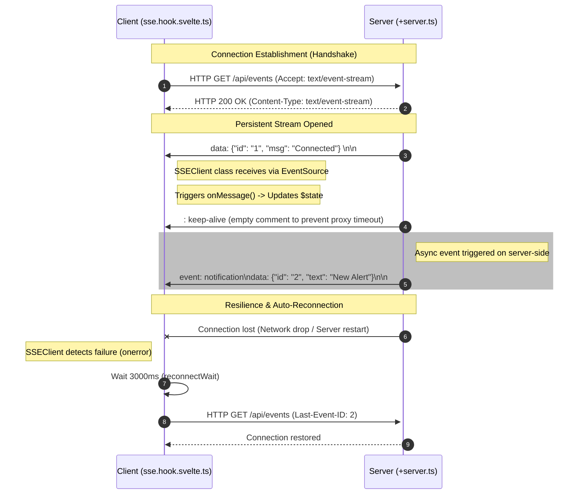

# SvelteKit SSE

Complete and type-safe **Server-Sent Events (SSE)** implementation for **Svelte 5** and **SvelteKit**, with automatic reconnection, reactive state, and TypeScript.

## 🚀 Key Features

- ⚡ **Reactive SSE client** with Svelte 5 runes (`$state`, `$effect`)
- 🔄 **Automatic reconnection** with configurable timeout
- 🎯 **Type-safe** with TypeScript generics
- 📡 **Automatic keep-alive** to maintain stable connections
- 🎨 **State management** (idle, connecting, connected, error)
- 🔌 **Simple and intuitive API** for both client and server
- 🛡️ **Robust error handling** with visual feedback
- 📦 **Zero external dependencies** (only Svelte and SvelteKit)

## 🛠️ Tech Stack

### 🎨 Frontend

- **[Svelte 5](https://svelte.dev/)** — reactive framework with runes
- **[SvelteKit 2](https://kit.svelte.dev/)** — full-stack framework for Svelte
- **[TypeScript](https://www.typescriptlang.org/)** — static typing
- **[Tailwind CSS 4](https://tailwindcss.com/)** — utility-first CSS framework
- **[Vite 7](https://vitejs.dev/)** — ultra-fast build tool and dev server

### 🔧 Development Tools

- **[Biome](https://biomejs.dev/)** — linting and formatting
- **[Ultracite](https://ultracite.dev/)** — unified CLI for linting
- **[pnpm](https://pnpm.io/)** — fast and efficient package manager

## 🏗️ Architecture and Patterns

- **🎯 Type-safe:** TypeScript generics for typed data
- **⚛️ Native reactivity:** uses Svelte 5 runes for reactive state
- **🔌 SSE standard:** complete implementation of the Server-Sent Events protocol
- **🔄 Resilient:** automatic reconnection in case of failures
- **📊 State management:** clear states (idle, connecting, connected, error)
- **🧩 Modular:** clear separation between client and server
- **♻️ Lifecycle management:** automatic resource cleanup

## 📖 What is Server-Sent Events (SSE)?

**Server-Sent Events** is a technology that allows the server to send real-time updates to the client through a persistent HTTP connection. Unlike WebSocket which is bidirectional, SSE is unidirectional (server → client), making it ideal for:

- 📢 **Real-time notifications**
- 📊 **Dashboards with live data**
- 📈 **Status updates**
- 💬 **Activity feeds**
- 🔔 **System alerts**

### Advantages of SSE over WebSocket

- ✅ Uses standard HTTP (no special protocol)
- ✅ Native automatic reconnection
- ✅ Event IDs for resumption
- ✅ Simpler to implement
- ✅ Compatible with proxies and CDNs
- ✅ Better for unidirectional communication

## 🔍 How It Works



## ⚙️ Prerequisites

Before you begin, make sure you have installed:

- **[Node.js](https://nodejs.org/)** >= 18.0.0
- **[pnpm](https://pnpm.io/)** >= 9.0.0 (package manager)

## 🚀 Installation and Setup

### 1️⃣ Clone the repository

```bash
git clone https://github.com/gustavomorinaga/sveltekit-sse.git
cd sveltekit-sse
```

### 2️⃣ Install dependencies

```bash
pnpm install
```

### 3️⃣ Start the development server

```bash
pnpm dev
```

The project will be available at:
- **Application:** <http://localhost:5173>

## 🏃‍♂️ Running the Project

### Development

```bash
pnpm dev
```

### Production Build

```bash
pnpm build
```

### Build Preview

```bash
pnpm preview
```

## 📝 Available Scripts

- `pnpm dev` — starts development server
- `pnpm build` — creates production build
- `pnpm preview` — previews production build
- `pnpm check` — checks TypeScript and Svelte types
- `pnpm check:watch` — checks types in watch mode
- `pnpm format` — formats code with Ultracite
- `pnpm lint` — runs linting with Ultracite

## 📁 Project Structure

```text
sveltekit-sse/
├── src/
│   ├── lib/
│   │   ├── hooks/
│   │   │   └── sse.hook.svelte.ts    # Reactive SSE client
│   │   └── server/
│   │       └── sse.ts                # SSE server utility
│   └── routes/
│       ├── +layout.svelte            # Global layout
│       ├── +page.svelte              # Main page (demo)
│       ├── layout.css                # Global styles
│       └── api/
│           └── notifications/
│               └── +server.ts        # SSE endpoint
├── static/                           # Static files
├── biome.jsonc                       # Biome configuration
├── package.json                      # Dependencies and scripts
├── pnpm-lock.yaml                    # pnpm lock file
├── svelte.config.js                  # SvelteKit configuration
├── tailwind.config.ts                # Tailwind configuration
├── tsconfig.json                     # TypeScript configuration
├── vite.config.ts                    # Vite configuration
└── README.md                         # This documentation
```

## 🔧 Client API (SSEClient)

### Creating an instance

```typescript
import { SSEClient } from "$lib/hooks/sse.hook.svelte";

interface Notification {
  id: string;
  message: string;
  type: "info" | "error";
  timestamp: string;
}

const client = new SSEClient<Notification>("/api/notifications", {
  eventName: "notification",      // SSE event name (default: "message")
  reconnectWait: 3000,            // Wait time for reconnection (default: 3000ms)
  autoConnect: true,              // Connect automatically (default: true)
  onMessage: (data) => {          // Callback when message is received
    console.log("New notification:", data);
  },
});
```

### Reactive Properties

The client exposes the following reactive properties (Svelte 5 runes):

```typescript
// Data from the last received message
client.data // Notification | null

// Connection status
client.status // "idle" | "connecting" | "connected" | "error"

// Error, if any
client.error // Error | null
```

### Methods

```typescript
// Connect manually (if autoConnect: false)
client.connect();

// Disconnect
client.close();
```

### Complete Component Example

```svelte
<script lang="ts">
  import { SSEClient } from "$lib/hooks/sse.hook.svelte";

  interface Message {
    id: string;
    text: string;
    timestamp: number;
  }

  let messages = $state<Message[]>([]);

  const stream = new SSEClient<Message>("/api/stream", {
    eventName: "message",
    onMessage: (msg) => {
      messages = [...messages, msg];
    },
  });
</script>

<div>
  <p>Status: {stream.status}</p>
  
  {#if stream.status === "connected"}
    <button onclick={stream.close}>Disconnect</button>
  {:else}
    <button onclick={stream.connect}>Connect</button>
  {/if}

  {#if stream.error}
    <p class="error">{stream.error.message}</p>
  {/if}

  {#each messages as message}
    <div>{message.text}</div>
  {/each}
</div>
```

## 🔧 Server API (produceSSE)

### Creating an SSE Endpoint

```typescript
// src/routes/api/stream/+server.ts
import { produceSSE } from "$lib/server/sse";

export const GET = () => {
  return produceSSE((emit) => {
    // Send events periodically
    const interval = setInterval(() => {
      emit("message", {
        id: crypto.randomUUID(),
        text: "New message!",
        timestamp: Date.now(),
      });
    }, 1000);

    // Cleanup function (will be called when connection closes)
    return () => {
      clearInterval(interval);
      console.log("Client disconnected");
    };
  });
};
```

### produceSSE Signature

```typescript
type SSEEmitter = (eventName: string, data: unknown) => void;
type SSEProducer = (emit: SSEEmitter) => () => void;

function produceSSE(producer: SSEProducer): Response
```

**Parameters:**
- `producer`: Function that receives an `emit` and returns a cleanup function
  - `emit(eventName, data)`: Sends an event to the client
  - `return`: Cleanup function executed when the connection is closed

**Returns:**
- `Response`: HTTP response with configured SSE stream

### Example with External Data

```typescript
import { produceSSE } from "$lib/server/sse";
import { db } from "$lib/server/db";

export const GET = () => {
  return produceSSE((emit) => {
    // Listener for database changes
    const unsubscribe = db.orders.onChange((order) => {
      emit("order", {
        id: order.id,
        status: order.status,
        total: order.total,
      });
    });

    // Cleanup
    return () => {
      unsubscribe();
    };
  });
};
```

## 📊 Example: Notification System

The project includes a complete example of a real-time notification system.

### Server ([src/routes/api/notifications/+server.ts](src/routes/api/notifications/+server.ts))

```typescript
import { produceSSE } from "$lib/server/sse";

const messages = [
  "User X just logged in",
  "New order received: Order #1234",
  "System backup completed",
  "Alert: High CPU usage detected",
  "New comment on your post",
];

export const GET = () => {
  return produceSSE((emit) => {
    const interval = setInterval(() => {
      const randomMessage = messages[Math.floor(Math.random() * messages.length)];

      emit("notification", {
        id: crypto.randomUUID(),
        message: randomMessage,
        type: Math.random() > 0.8 ? "error" : "info",
        timestamp: new Date().toLocaleTimeString(),
      });
    }, 3000);

    return () => clearInterval(interval);
  });
};
```

### Client ([src/routes/+page.svelte](src/routes/+page.svelte))

```svelte
<script lang="ts">
  import { SSEClient } from "$lib/hooks/sse.hook.svelte";

  interface Notification {
    id: string;
    message: string;
    type: "info" | "error";
    timestamp: string;
  }

  let notifications = $state<Notification[]>([]);

  const stream = new SSEClient<Notification>("/api/notifications", {
    eventName: "notification",
    onMessage: (newNotification) => {
      notifications = [newNotification, ...notifications].slice(0, 10);
    },
  });
</script>

<main>
  <h1>Real-Time Notifications</h1>
  
  <div class="status">
    {#if stream.status === "connected"}
      🟢 Connected
    {:else if stream.status === "connecting"}
      🟡 Connecting...
    {:else if stream.status === "error"}
      🔴 Error: {stream.error?.message}
    {:else}
      ⚪ Disconnected
    {/if}
  </div>

  {#each notifications as notification}
    <div class="notification" class:error={notification.type === "error"}>
      <strong>{notification.timestamp}</strong>
      {notification.message}
    </div>
  {/each}
</main>
```

## 🎯 Use Cases

### 1. Real-Time Dashboard

```typescript
// Server
export const GET = () => {
  return produceSSE((emit) => {
    const interval = setInterval(async () => {
      const metrics = await getSystemMetrics();
      emit("metrics", metrics);
    }, 5000);

    return () => clearInterval(interval);
  });
};

// Client
const metrics = new SSEClient<SystemMetrics>("/api/metrics", {
  eventName: "metrics",
});
```

### 2. Activity Feed

```typescript
// Server
export const GET = ({ locals }) => {
  return produceSSE((emit) => {
    const userId = locals.user.id;
    
    const unsubscribe = subscribeToUserActivities(userId, (activity) => {
      emit("activity", activity);
    });

    return unsubscribe;
  });
};

// Client
const activities = new SSEClient<Activity>("/api/activities", {
  eventName: "activity",
  onMessage: (activity) => {
    toast.info(activity.message);
  },
});
```

### 3. Task Progress

```typescript
// Server
export const GET = async ({ url }) => {
  const taskId = url.searchParams.get("taskId");

  return produceSSE((emit) => {
    const task = getTask(taskId);
    
    task.on("progress", (progress) => {
      emit("progress", { percent: progress });
    });

    task.on("complete", () => {
      emit("complete", { success: true });
    });

    return () => task.cleanup();
  });
};

// Client
const taskProgress = new SSEClient<{ percent: number }>("/api/task?taskId=123", {
  eventName: "progress",
});
```

## 🔒 Security and Best Practices

### Authentication

```typescript
// Server
import type { RequestEvent } from "@sveltejs/kit";

export const GET = async ({ locals }: RequestEvent) => {
  // Check authentication
  if (!locals.user) {
    return new Response("Unauthorized", { status: 401 });
  }

  return produceSSE((emit) => {
    // Only events for authenticated user
    const unsubscribe = listenToUserEvents(locals.user.id, emit);
    return unsubscribe;
  });
};
```

### Rate Limiting

```typescript
import { rateLimit } from "$lib/server/rate-limit";

export const GET = async ({ getClientAddress }) => {
  const ip = getClientAddress();
  
  if (!rateLimit.check(ip)) {
    return new Response("Too Many Requests", { status: 429 });
  }

  return produceSSE((emit) => {
    // ...
  });
};
```

### Connection Timeout

```typescript
export const GET = () => {
  return produceSSE((emit) => {
    const timeout = setTimeout(() => {
      emit("timeout", { message: "Connection expired" });
    }, 300000); // 5 minutes

    return () => clearTimeout(timeout);
  });
};
```

## 🐛 Debugging

### Client Logs

```typescript
const client = new SSEClient<Data>("/api/stream", {
  onMessage: (data) => {
    console.log("[SSE] Message received:", data);
  },
});

// Watch status changes
$effect(() => {
  console.log("[SSE] Status:", client.status);
  if (client.error) {
    console.error("[SSE] Error:", client.error);
  }
});
```

### Server Logs

```typescript
export const GET = () => {
  console.log("[SSE] New connection established");

  return produceSSE((emit) => {
    emit("connected", { timestamp: Date.now() });

    const interval = setInterval(() => {
      console.log("[SSE] Sending data...");
      emit("data", { value: Math.random() });
    }, 1000);

    return () => {
      console.log("[SSE] Connection closed");
      clearInterval(interval);
    };
  });
};
```

## 🚀 Deploy

### Vercel

SvelteKit works perfectly on Vercel with SSE:

```bash
pnpm add -D @sveltejs/adapter-vercel
```

```javascript
// svelte.config.js
import adapter from "@sveltejs/adapter-vercel";

export default {
  kit: {
    adapter: adapter(),
  },
};
```

### Node.js

```bash
pnpm add -D @sveltejs/adapter-node
```

```javascript
// svelte.config.js
import adapter from "@sveltejs/adapter-node";

export default {
  kit: {
    adapter: adapter(),
  },
};
```

### Cloudflare Pages

⚠️ **Note:** SSE may have limitations in edge environments. Consult Cloudflare's documentation.

## 🤝 Contributing

Contributions are welcome! Feel free to:

1. Fork the project
2. Create a branch for your feature (`git checkout -b feat/my-feature`)
3. Commit your changes (`git commit -m 'feat: add my feature'`)
4. Push to the branch (`git push origin feat/my-feature`)
5. Open a Pull Request

## 📄 License

This project is licensed under the MIT License. See the [LICENSE](LICENSE) file for more details.

---

⭐ Made with ❤️ by [Gustavo Morinaga](https://gustavomorinaga.dev)
